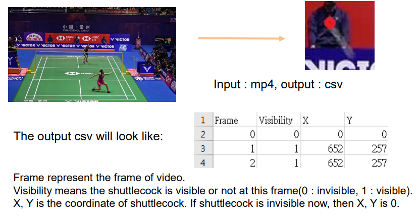
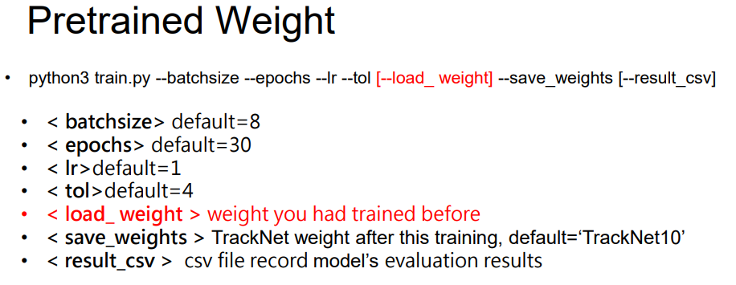
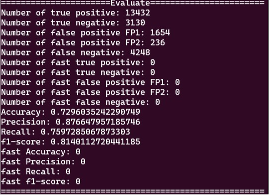

# TrackNet-Badminton

[TrackNet_video_p17.mp4](TrackNet_video_p17.mp4)  
[TrackNet_video_p48.mp4](TrackNet_video_p48.mp4)

<h1> Windows 教學 </h1>
<h2> Labeling Data </h2>

1. label_tool.py
2. $ cd /train_data/match1/video -->  把4個video放入video folder
3. $ python3 label_tool.py ./video/2024-10-11_16-27-34_0.mp4

<h3> Label Tool Usage </h3>

* Last Frame: z
* Next Frame: x
* Last 50 Frame: d
* Next 50 Frame: f
* Label: left click
* Zoom: a (centered on the last label)
* Clear Label: c
* Quit & Save: q
* Quit without saving: Esc

<h3> Labeling Rules </h3>

1. Please mark the head of shuttlecock
2. No need to mark the shuttlecock if it is blocked and not visible
3. No need to mark the ball if it is stationary or held by a person

<h2> Frame Generator </h2> 

1. 影片切割 frame_generator.py
2. $ python3 .\frame_generator.py --dataset_folder .\train_data\ --locations match1

<h2> Detect Fast </h2> 

1. $ python3 detect_fast.py --dataset_folder --locations

<h2> Preprocess </h2> 

1. 前處理做成heatmap preprocess.py
2. $ python3 .\preprocess.py --dataset_folder .\train_data\ --locations match1 --info_csv train_data_info.csv --result_csv train_data_result.csv --test 0

<h2> Training </h2> 

訓練要很久甚至好幾天
1. 訓練模型 (這邊可以先引入pretrain weight，準確率提升較快) train.py
2. $ python3 .\train.py --result_csv train_data_result.csv
3. $ python3 train.py --batchsize 16 --epochs 50 --lr 0.001 --tol 3 --save_weights TrackNet12 --result_csv evaluation_results.csv

<h3>必選參數</h3>
* --batchsize：設定批次大小。默認為 8。 用法範例：--batchsize 16（將批次大小設為16）。
* --epochs：設定訓練的總回合數。默認為 30。 用法範例：--epochs 50（訓練 50 個回合）。
* --lr：設定學習率（Learning Rate）。默認為 1。 用法範例：--lr 0.001（將學習率設為 0.001）。
* --tol：設定正確分類的容忍度。默認為 4。 用法範例：--tol 3（將容忍度設為 3）。

<h3>可選參數</h3>
* --load_weight：加載之前訓練的權重檔案。這參數用於繼續之前中斷的訓練。 用法範例：--load_weight model_weights.pth（加載已訓練的模型權重檔案）。
* --save_weights：訓練完成後保存權重的名稱，默認為 'TrackNet10'。 用法範例：--save_weights TrackNet12（保存權重為 TrackNet12）。
* --result_csv：輸出模型評估結果到指定的 CSV 檔案。 用法範例：--result_csv results.csv（將模型的評估結果保存到 results.csv）。

<h2> Testing </h2> 

1. $ python3 .\frame_generator.py --dataset_folder .\test_data\ --locations match1
2. $ python3 .\detect_fast.py --dataset_folder .\test_data\ --locations match1 
3. $ python3 .\preprocess.py --dataset_folder .\test_data\ --locations match1 --info_csv test_data_info.csv --result_csv test_data_result.csv --test 1
4. $ python3 .\test.py --load_weight .\TrackNet10_30.tar --location match1 --info_csv match_1_test_result.csv

<h2> Predict </h2> 

1. $ python3 .\predict.py --video_name match_test_1 /video/1_02_01.mp4 --load_weight TrackNet10_30.tar --output_dir output 
2. $ python3 .\predict.py --video_name C:\Users\user\Downloads\交大\深度學習\LAB1\sourcecode_v2\code\test_data\match1\video\1_03_04.mp4 --load_weight .\TrackNet10_30.tar --output_dir output

<h1> Ubuntu 教學 </h1>

<h2> Labeling Data </h2>

1. label_tool.py
2. $ cd /train_data/match1/video -->  把4個video放入video folder
3. $ python3 label_tool.py ./video/2024-10-11_16-27-34_0.mp4

Label Tool Usage
* Last Frame: z
* Next Frame: x
* Last 50 Frame: d
* Next 50 Frame: f
* Label: left click
* Zoom: a (centered on the last label)
* Clear Label: c
* Quit & Save: q
* Quit without saving: Esc

<h2> Frame Generator </h2> 

1. 影片切割 frame_generator.py
2. $ python3 frame_generator.py --dataset_folder train_data/ --locations match1

<h2> Detect Fast </h2> 

1. $ python3 detect_fast.py --dataset_folder --locations

<h2> Preprocess </h2> 

1. 前處理做成heatmap preprocess.py
2. $ python3 preprocess.py --dataset_folder train_data/ --locations match1 --info_csv train_data_info.csv --result_csv train_data_result.csv --test 0

<h2> Training </h2> 

訓練要很久甚至好幾天
1. 訓練模型 (這邊可以先引入pretrain weight，準確率提升較快) train.py
2. $ python3 train.py --result_csv train_data_result.csv
3. $ python3 train.py --batchsize 16 --epochs 50 --lr 0.001 --tol 3 --save_weights TrackNet12 --result_csv evaluation_results.csv

<h3>必選參數</h3>
* --batchsize：設定批次大小。默認為 8。 用法範例：--batchsize 16（將批次大小設為16）。
* --epochs：設定訓練的總回合數。默認為 30。 用法範例：--epochs 50（訓練 50 個回合）。
* --lr：設定學習率（Learning Rate）。默認為 1。 用法範例：--lr 0.001（將學習率設為 0.001）。
* --tol：設定正確分類的容忍度。默認為 4。 用法範例：--tol 3（將容忍度設為 3）。

<h3>可選參數</h3>
* --load_weight：加載之前訓練的權重檔案。這參數用於繼續之前中斷的訓練。 用法範例：--load_weight model_weights.pth（加載已訓練的模型權重檔案）。
* --save_weights：訓練完成後保存權重的名稱，默認為 'TrackNet10'。 用法範例：--save_weights TrackNet12（保存權重為 TrackNet12）。
* --result_csv：輸出模型評估結果到指定的 CSV 檔案。 用法範例：--result_csv results.csv（將模型的評估結果保存到 results.csv）。

<h2> Testing </h2> 

1. $ python3 frame_generator.py  --dataset_folder test_data/ --locations match1
2. $ python3 detect_fast.py --dataset_folder test_data/ --locations match1
3. $ python3 preprocess.py --dataset_folder test_data/ --locations match1 --info_csv test_data_info.csv --result_csv test_data_result.csv --test 1
4. $ python3 test.py --load_weight TrackNet10_30.tar  --location match1 --info_csv match_1_test_result.csv

<h2> Predict </h2> 

1. $ python3 predict.py --video_name match_test_1 /video/1_02_01.mp4 --load_weight TrackNet10_30.tar --output_dir output 
2. $ python3 predict.py --video_name C:\Users\user\Downloads\交大\深度學習\LAB1\sourcecode_v2\code\test_data\match1\video\1_03_04.mp4 --load_weight .\TrackNet10_30.tar --output_dir output

<h2> Reference </h2>

Network Optimization Lab (NOL)  
Department of Computer Science  
National Yang Ming Chiao Tung University